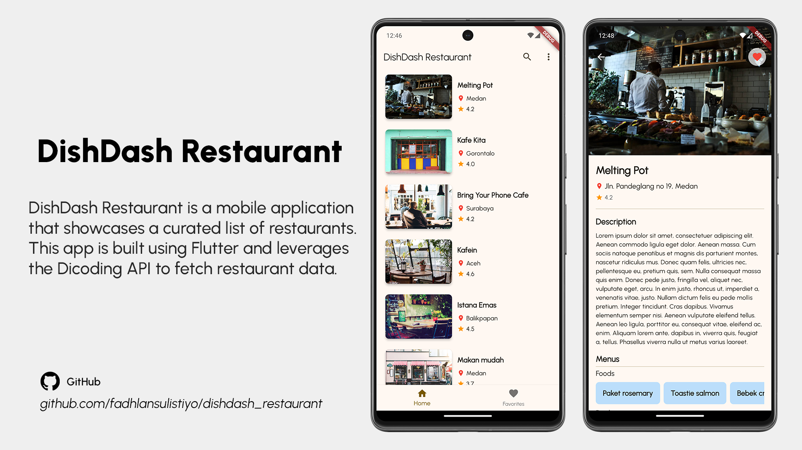
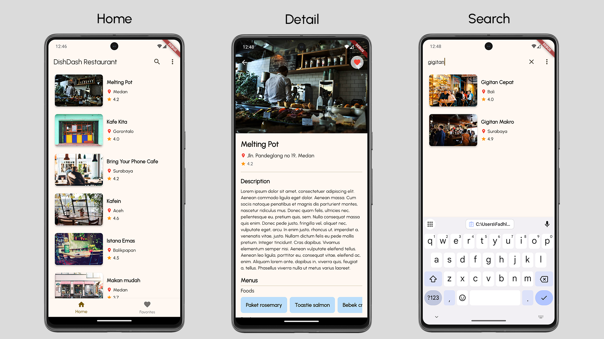
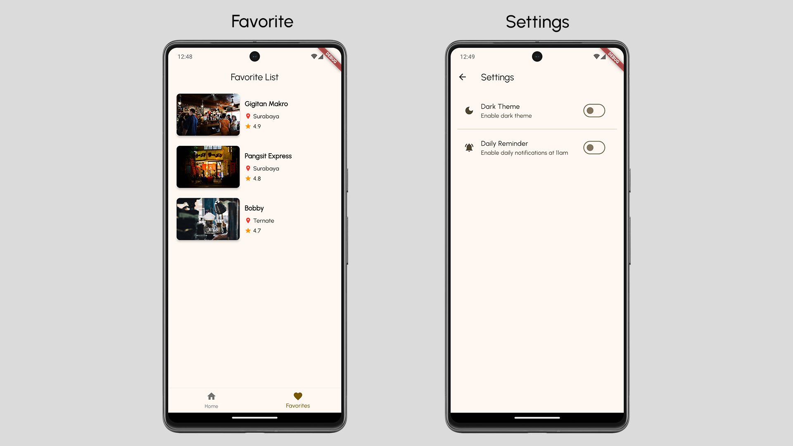

# DishDash Restaurant

**DishDash Restaurant** is a mobile application that showcases a curated list of restaurants. This app is built using Flutter and leverages the Dicoding API to fetch restaurant data. It allows users to browse restaurants, view detailed information, search for specific restaurants, and manage their favorites. The app also offers theme preferences and notification settings for enhanced usability.

## Features
- **Restaurant List Display**: View a list of available restaurants with relevant details.
- **Restaurant Details**: Explore detailed information about each restaurant, including its menu, ratings, and reviews.
- **Search Functionality**: Search for restaurants by name.
- **Favorites Management**: Save your favorite restaurants for quick access later.
- **Theme Preferences**: Switch between light mode and dark mode for personalized app themes.
- **Notification Settings**: Manage notifications and scheduling preferences.

## Prerequisites
Ensure you have the following before building and running the app:
- **Gradle Version**: 8.4
- **Android Application Version**: 8.3.2

## Tech Stack
- **Hero Animation**: Provides smooth and customizable animations between widgets.
- **Sliver Widgets**: Used to create flexible and elegant scrolling effects.
- **Provider (State Management)**: Manages state changes throughout the app.
- **Future & HTTP Package**: Enables asynchronous data fetching and networking.
- **SharedPreferences**: Handles storing user preferences for themes and notifications.
- **SQLite**: Manages data persistence for user favorites.
- **Unit Testing**: Ensures app reliability and stability through comprehensive tests.
- **Notification & Scheduler**: Enables timely user notifications.

## Demo (Screenshots)

